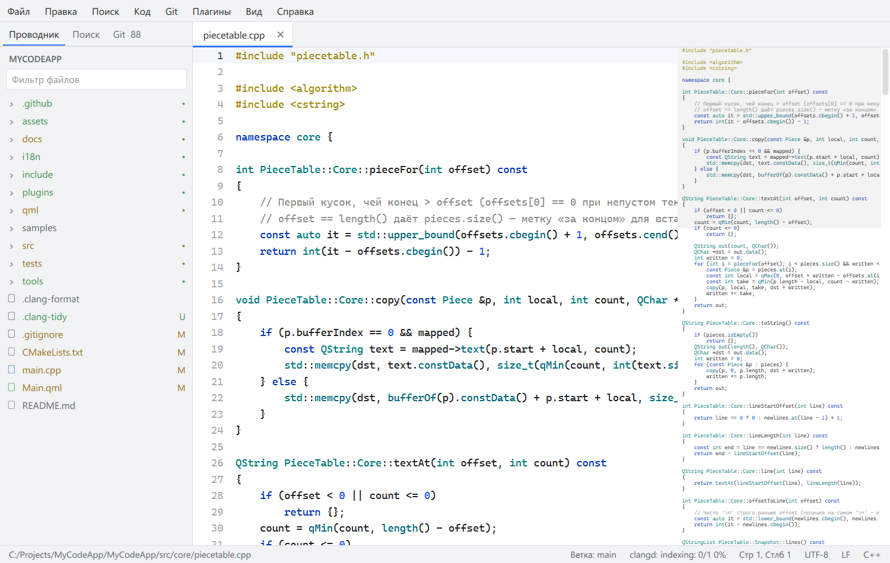

# MyCodeApp


**MyCodeApp** — редактор кода на C++20 и Qt 6 / QML с упором на скорость:
файлы до 1 ГБ, несколько курсоров, LSP, Git, темы, сниппеты и плагины.


<details>
<summary>Светлая тема</summary>


</details>

---

## Содержание

- [Возможности](#возможности)
- [Производительность](#производительность)
- [Установка](#установка)
- [Сборка из исходников](#сборка-из-исходников)
- [Настройка](#настройка)
- [Горячие клавиши](#горячие-клавиши)
- [Тесты и CI](#тесты-и-ci)
- [Архитектура](#архитектура)

---

## Возможности

**Редактирование**
- Несколько курсоров: Alt+клик, курсоры выше и ниже, выделение следующего
  вхождения, выделение столбцом с клавиатуры и мышью. Любая правка на всех
  курсорах отменяется одним шагом.
- Умный ввод: парные скобки и кавычки, оборачивание выделения, автоотступы,
  отступ табами или пробелами — как в файле, подсветка парной скобки.
- Сворачивание блоков по скобкам и отступам, миникарта с тремя масштабами.
- Сниппеты с позициями ввода (Tab / Shift+Tab), зеркалами и переменными —
  в формате VS Code.

**Файлы и проект**
- UTF-8, UTF-16 LE/BE, Windows-1251, Latin-1 с автоопределением; переводы строк
  LF / CRLF / CR сохраняются как были. Атомарное сохранение.
- Файлы до 1 ГБ: от 256 МБ — отображение в память, только чтение.
- Несохранённые правки переживают сбой и закрытие окна.
- Папка проекта: дерево с учётом `.gitignore`, сессия (вкладки, курсоры,
  прокрутка), слежение за изменениями на диске, поиск по проекту, Ctrl+P.

**Подсветка**
- C/C++, Python, QML (с JavaScript) — tree-sitter в фоновом потоке
  с инкрементальным пересчётом; JSON и Markdown — регулярные выражения.

**Языковые серверы (LSP)**
- clangd, qmlls, pyright, rust-analyzer: автодополнение с документацией,
  подсказки при наведении, переход к определению, ссылки, переименование,
  форматирование, диагностика с панелью «Проблемы».

**Git** (libgit2, без сети)
- Буквы состояния в дереве, полоски изменений в gutter, просмотр изменений
  файла, панель: индекс, отмена изменений, коммит, ветки.

**Расширяемость**
- Темы в JSON (тёмная и светлая встроены, свои применяются при сохранении),
  настраиваемые горячие клавиши, плагины на C++ (Qt-плагины) с включением
  и выключением без перезапуска.

**Прочее**
- Интерфейс на русском и английском, переключение на лету.
- Интеграция с Проводником Windows: «Открыть с помощью» и «Открыть в MyCodeApp»
  для папок; второй запуск передаёт файлы уже открытому окну.
- Портативный режим и профили настроек.

## Производительность

Release, MinGW, Windows 11:

| Операция | Результат |
|---|---|
| Открытие файла 1 ГБ (отображение в память) | 2,5 с |
| Открытие файла 131 МБ / 1,16 млн строк (фоновая загрузка) | ~0,5 с |
| Прокрутка файла 131 МБ | 60 FPS |
| Вставка в середину файла 131 МБ | 0,19 мс |
| Правка на 1000 курсорах (10 000 строк) + отмена | < 10 мс |
| Разбор tree-sitter, C++ 1 МБ: полный / после правки строки | ~135 мс / ~18 мс (в фоне) |
| Автодополнение clangd | 26–58 мс |

## Установка

Готовая сборка для Windows — `MyCodeApp-<версия>-win64-portable.zip` в
[Releases](https://github.com/Alexey-Izilianov/MyCodeApp/releases): распаковать
и запустить `appMyCodeApp.exe`. Архив портативный — настройки хранятся в папке
`data` рядом с программой.

Чтобы открывать файлы из Проводника: «Файл → Добавить в «Открыть с помощью»»
(пишет в реестр текущего пользователя, права администратора не нужны).

## Сборка из исходников

Требования: Qt 6.11 (на Windows — MinGW 64-bit), CMake 3.20+, Ninja, интернет
при первой конфигурации (FetchContent скачивает spdlog, tree-sitter и libgit2).

```bash
cmake -G Ninja -S . -B build/Release -DCMAKE_BUILD_TYPE=Release -DCMAKE_PREFIX_PATH=C:/Qt/6.11.2/mingw_64
cmake --build build/Release
build/Release/appMyCodeApp.exe [--profile имя] [файл|папка]...
```

Портативный архив: `./tools/package.ps1` (нужен `windeployqt` в PATH) →
`dist/MyCodeApp-<версия>-win64-portable.zip`.

После правки строк интерфейса — обновить перевод:
`cmake --build build/Release --target update_translations`, затем перевести
новые строки в `i18n/mycodeapp_en.ts` (Qt Linguist).

## Настройка

Все данные — в папке данных: `%LOCALAPPDATA%/appMyCodeApp`, в портативном
режиме — `data` рядом с exe, для профиля (`--profile имя`) — подпапка
`profiles/имя`. Папку открывает «Справка → Открыть папку данных».

| Что | Где | Как |
|---|---|---|
| Тема | `themes/*.json` | «Вид → Тема → Создать свою тему…»: копия текущей открывается во вкладке, сохранение сразу применяет цвета |
| Горячие клавиши | `keybindings.json` | «Файл → Настройки → Горячие клавиши»; двойные сочетания (`Ctrl+K, D`) — в файле |
| Сниппеты | `snippets/<язык>.json`, `snippets/global.json` | «Код → Свои сниппеты для этого языка…», формат VS Code |
| Языковые серверы | `lsp.json` | описание сервера заменяет встроенное (`assets/lsp.json`) |
| Плагины | `plugins/*.dll` и `<exe>/plugins` | «Плагины → Управление плагинами…» |

**Плагин** — Qt-плагин, собранный тем же компилятором и Qt. API —
[include/mycodeapp/plugin.h](include/mycodeapp/plugin.h): команды в меню
и в горячих клавишах, доступ к тексту и выделению. Пример —
[plugins/texttools](plugins/texttools/texttools.cpp).

## Горячие клавиши

Все команды меню переназначаются в настройках. По умолчанию:

| Действие | Клавиши |
|---|---|
| Открыть файл / папку, сохранить, закрыть вкладку | Ctrl+O / Ctrl+K Ctrl+O, Ctrl+S, Ctrl+W |
| Перейти к файлу / к строке | Ctrl+P / Ctrl+G |
| Найти / в проекте | Ctrl+F (F3, Shift+F3) / Ctrl+Shift+F |
| Курсоры: выше, ниже, следующее вхождение | Ctrl+Alt+↑ / ↓, Ctrl+D, Alt+клик |
| Выделение столбцом | Alt+Shift+стрелки, Alt+протяжка |
| Свернуть / развернуть блок, всё | Ctrl+Shift+[ / ], Ctrl+K Ctrl+0 / Ctrl+K Ctrl+J |
| Автодополнение, определение, ссылки | Ctrl+Space, F12, Shift+F12 |
| Переименовать, форматировать | F2, Shift+Alt+F |
| Панель Git, изменения файла, к изменению | Ctrl+Shift+G, Ctrl+K D, Alt+F5 / Shift+Alt+F5 |
| Боковая панель: показать, перейти, назад в редактор | Ctrl+B, Ctrl+0, Ctrl+1 / Esc |
| Настройки | Ctrl+, |

## Тесты и CI

Qt Test, 14 наборов: piece table, кодировки, правила редактирования,
документ и история, восстановление, поиск, подсветка (регэкспы и tree-sitter),
сворачивание, проект и `.gitignore`, git-обёртка, сниппеты, редактор через
реальные события клавиатуры и мыши.

```bash
ctest --test-dir build/Release
```

GitHub Actions ([ci.yml](.github/workflows/ci.yml)): сборка и тесты на Windows
(MinGW), Linux (GCC) и macOS (Clang), Linux с ASan+UBSan и TSan, clang-tidy;
по тегу `v*` — портативный архив в Releases.

## Архитектура

```
src/core/       PieceTable, TextBuffer, Document (история), сворачивание, сниппеты
src/gui/        EditorView (Qt Scene Graph), миникарта
src/services/   вкладки, проект, поиск, подсветка, восстановление, темы,
                горячие клавиши, сниппеты, плагины, настройки, локализация
src/lsp/        клиент JSON-RPC и менеджер языковых серверов
src/git/        обёртка libgit2 и сервис Git
qml/            интерфейс
include/        API плагинов
```

- **Текст** — собственная piece table: правка не копирует существующий текст,
  строковый индекс обновляется инкрементально.
- **Фоновые задачи** (поиск, tree-sitter, git) работают с неизменяемыми
  снимками piece table — копия стоит O(1), блокировки не нужны.
- **Правки** идут только через `Document::replace()` — всё попадает
  в историю отмены и в журнал восстановления.
- **Рендер** — `QQuickItem` с нодами Scene Graph: глифы в GPU-атласе,
  при прокрутке меняется только матрица (выбор подтверждён замером: 60 FPS
  против 13–23 у `QQuickPaintedItem` на файле 131 МБ).

## Лицензия

Не определена: все права сохранены за автором.
