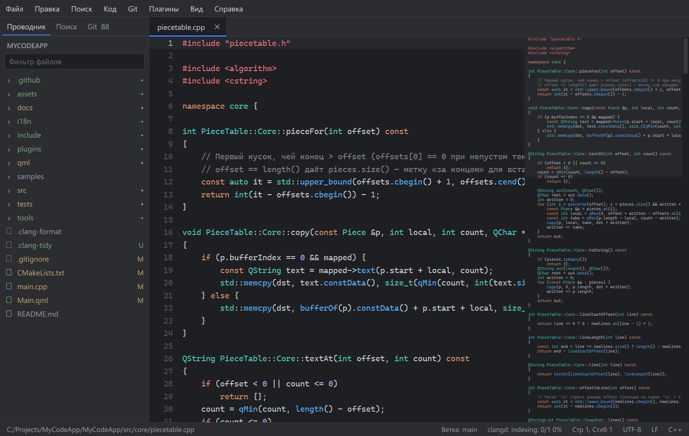

# MyCodeApp


**MyCodeApp** — редактор кода на C++20 и Qt 6 / QML с упором на скорость
работы с большими файлами. Цель — уровень Sublime Text / VS Code-lite:
файлы до 1 ГБ, multi-cursor, LSP, Git, плагины и темы.



---

## Содержание

- [Возможности](#возможности)
- [Производительность](#производительность)
- [Горячие клавиши](#горячие-клавиши)
- [Сборка и запуск](#сборка-и-запуск)
- [Тесты](#тесты)
- [Архитектура](#архитектура)
- [План работ](#план-работ)
- [Лицензия](#лицензия)

---

## Возможности

**Редактирование**
- Отмена и повтор без ограничения глубины; посимвольный ввод отменяется
  одним шагом, история у каждой вкладки своя.
- Флаг «изменён» следует истории: отмена до сохранённого состояния его снимает.
- Умный ввод: парные скобки и кавычки с перешагиванием закрывающей,
  оборачивание выделения, отступ после `{` и `:` (Python), вынос `}` на
  отдельную строку, Tab / Shift+Tab по строкам, стиль отступа (табы или
  пробелы) определяется по файлу; подсветка парной скобки.
- Табуляция рисуется до табстопа, курсор и выделение считают визуальные колонки.
- Навигация по словам, «умный» Home, выделение слова двойным кликом
  и строки — кликом по её номеру.
- Несколько курсоров: Alt+клик, добавление выше/ниже, выделение следующего
  вхождения, выделение столбцом клавиатурой и мышью; ввод, удаление и вставка
  работают на всех курсорах сразу и отменяются одним шагом.
- Горизонтальная прокрутка длинных строк; курсоры и прокрутка запоминаются
  для каждой вкладки.

**Файлы**
- Кодировки UTF-8, UTF-16 LE/BE, Windows-1251, Latin-1 (автоопределение по BOM
  и содержимому), переводы строк LF / CRLF / CR — сохраняются как были.
- Большие файлы (> 20 МБ) грузятся в фоне с индикатором прогресса.
- Атомарное сохранение (`QSaveFile`): при сбое старый файл не теряется.
- Несохранённые правки не теряются ни при сбое, ни при закрытии окна: они
  пишутся в журнал на диске и при следующем запуске вкладки открываются
  снова (Ctrl+Z вернёт версию с диска).

**Подсветка синтаксиса**
- C/C++, Python и QML (вместе с JavaScript внутри) — tree-sitter: разбор в фоновом потоке, после правки
  пересчитывается только изменённый участок, многострочные комментарии
  и строки подсвечиваются корректно.
- JSON и Markdown — правила на регулярных выражениях
  ([assets/highlight.json](assets/highlight.json)); они же используются,
  пока идёт первый разбор, и для файлов больше 8 млн символов.

**Поиск**
- Поиск по файлу в фоновом потоке, с учётом регистра или без,
  переход по совпадениям F3 / Shift+F3.

## Производительность

Замеры на эталонном файле 131 МБ / 1,16 млн строк (Release, MinGW):

| Операция | Результат |
|---|---|
| Открытие файла (фоновая загрузка) | ~0,5 с |
| Прокрутка | 60 FPS |
| Вставка в середину файла | 0,19 мс |
| 1000 undo + 1000 redo | единицы мс |
| Правка на 1000 курсорах (файл 10 000 строк) + отмена | < 10 мс |
| Разбор tree-sitter, C++ 1 МБ: полный / после правки строки | ~135 мс / ~18 мс (в фоне) |

## Горячие клавиши

| Действие | Клавиши |
|---|---|
| Открыть / сохранить / закрыть вкладку | Ctrl+O / Ctrl+S / Ctrl+W |
| Следующая / предыдущая вкладка | Ctrl+Tab / Ctrl+Shift+Tab |
| Отменить / повторить | Ctrl+Z / Ctrl+Y (Ctrl+Shift+Z) |
| Вырезать / копировать / вставить / выделить всё | Ctrl+X / Ctrl+C / Ctrl+V / Ctrl+A |
| Перемещение по словам / удаление слова | Ctrl+← → / Ctrl+Backspace, Ctrl+Delete |
| Начало / конец файла | Ctrl+Home / Ctrl+End |
| Сдвинуть строки вправо / влево | Tab / Shift+Tab (с выделением) |
| Добавить курсор / курсор выше, ниже | Alt+клик / Ctrl+Alt+↑, Ctrl+Alt+↓ |
| Выделить следующее вхождение | Ctrl+D |
| Выделение столбцом | Alt+Shift+стрелки, Alt+протяжка мышью |
| Оставить один курсор | Esc |
| Найти / следующее / предыдущее | Ctrl+F / F3 / Shift+F3 |

Файл также можно открыть, перетащив его в окно, или передать путь аргументом:
`appMyCodeApp.exe C:/path/to/file.cpp`.

## Сборка и запуск

### Windows

Требования: Qt 6.11 (MinGW 64-bit), CMake 3.20+, Ninja, доступ в интернет
при первой конфигурации (CMake скачивает spdlog и tree-sitter через FetchContent).

```bash
# конфигурация (путь к Qt подставить свой)
cmake -G Ninja -B build/Release -S . ^
      -DCMAKE_BUILD_TYPE=Release ^
      -DCMAKE_PREFIX_PATH=C:/Qt/6.11.2/mingw_64

# сборка
cmake --build build/Release

# запуск (каталог Qt bin должен быть в PATH)
build/Release/appMyCodeApp.exe
```

Проект также открывается в Qt Creator как обычный CMake-проект.

Лог приложения: `%LOCALAPPDATA%/appMyCodeApp/app.log`.

## Тесты

Юнит-тесты на Qt Test собираются вместе с приложением:

| Набор | Что проверяет |
|---|---|
| `test_piecetable` | piece table: правки, строковый индекс, снимки |
| `test_core` | TextBuffer: кодировки, переводы строк, журнал правок |
| `test_editing` | визуальные колонки, стиль отступа, парные скобки |
| `test_document` | загрузка, сохранение, история undo/redo |
| `test_recovery` | журнал несохранённых правок и восстановление |
| `test_searchengine` | фоновый поиск |
| `test_highlighter` | подсветка на регулярных выражениях |
| `test_treesitter`, `test_syntaxhighlighter` | tree-sitter: грамматики, запросы, инкрементальный разбор |
| `test_editorview` | редактор через реальные события клавиатуры и мыши (открывает окно) |

```bash
set QT_PLUGIN_PATH=C:/Qt/6.11.2/mingw_64/plugins
build/Release/test_document.exe
# или все сразу
ctest --test-dir build/Release
```

## Тестовые файлы

В [samples/](samples/README.md) — файлы для ручной проверки, по трём
категориям: `small/` (подсветка всех языков, табуляция, кодировки, CRLF,
Unicode), `medium/` (~1 МБ на язык) и `large/` (7,5–150 МБ, строка на 10 МБ,
по желанию 1 ГБ). Средние и большие создаёт `python samples/generate.py`.

## Архитектура

```
src/core/       PieceTable, TextBuffer (кодировки, журнал правок), Document (файл + история)
src/services/   DocumentManager (вкладки), SyntaxHighlighter (tree-sitter),
                Highlighter (регулярные выражения), SearchEngine, логирование
src/gui/        EditorView — редактор на нодах Qt Scene Graph
qml/            компоненты интерфейса; Theme.qml — палитра
assets/         правила подсветки и tree-sitter-запросы (assets/queries/*.scm)
tests/          Qt Test
```

- **Текст** хранится в собственной piece table: правка не копирует и не
  сдвигает существующий текст, строковый индекс обновляется инкрементально.
- **Фоновые задачи** (поиск, разбор tree-sitter) работают с неизменяемыми
  снимками piece table — копирование снимка стоит O(1), блокировки не нужны.
- **Правки** проходят только через `Document::replace()`, поэтому всё
  попадает в историю отмены; журнал правок буфера питает инкрементальную подсветку.
- **Рендер**: GUI полностью на QML, редактор — `QQuickItem` с нодами Scene
  Graph. Глифы кэшируются в GPU-атласе, при прокрутке меняется только матрица
  трансформации; на каждый цвет подсветки — одна текстовая нода.

Выбор рендера закрыт двумя спайками на файле 131 МБ:

| Подход | Результат | Вердикт |
|---|---|---|
| `QQuickPaintedItem` (растеризация на CPU) | 13–23 FPS | отклонён |
| Ноды Scene Graph (`QSGTextNode` + GPU-атлас) | 60–61 FPS | принят |

## План работ

Один этап — один майлстоун: чистая сборка, зелёные тесты, коммит с тегом.

- [x] **Этап 0 — архитектура и спайки рендера**
- [x] **M1 — MVP**: TextBuffer, кодировки, переводы строк, редактор, вкладки,
      подсветка по правилам, поиск в файле, логирование, тесты
- [ ] **M2 — ядро редактора** (в работе)
  - [x] piece table с инкрементальным строковым индексом
  - [x] подсветка на tree-sitter (C++, Python)
  - [x] undo/redo без ограничения глубины
  - [x] несколько курсоров и выделение столбцом
  - [x] умный ввод: авто-отступы, парные скобки, табуляция
  - [ ] сворачивание блоков, mmap для гигантских файлов, миникарта
  - [x] восстановление несохранённых правок после сбоя и закрытия
- [ ] **M3 — проект**: дерево файлов, сессии, отслеживание изменений на диске,
      поиск по проекту, Ctrl+P
- [ ] **M4 — LSP**: автодополнение, переход к определению, диагностика
      (clangd / pyright / rust-analyzer)
- [ ] **M5 — Git**: изменения в gutter, diff, stage/commit, ветки, blame
- [ ] **M6 — расширяемость**: плагины, сниппеты, темы, настройка клавиш
- [ ] **M7 — полировка**: CI, санитайзеры, локализация RU/EN, релиз 1.0

## Лицензия

Не определена. Пока все права сохранены за автором.
